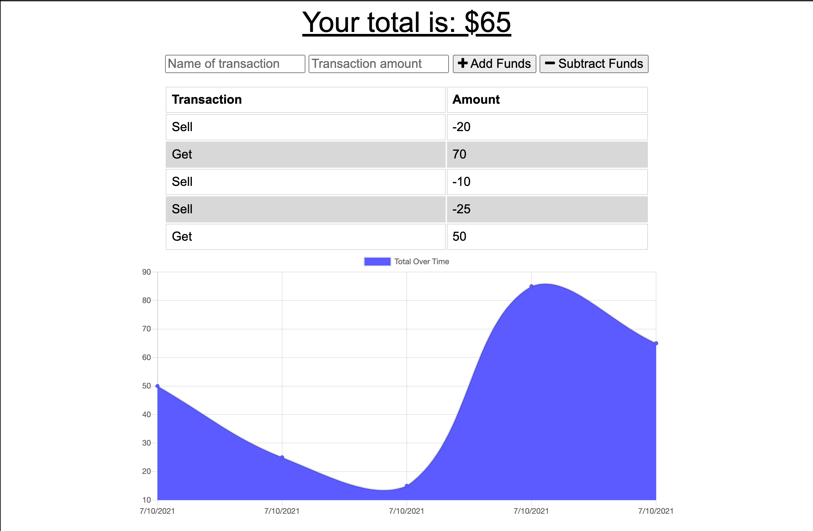

# Budget Tracker
  
## Description

An app where users can add transactions in order to keep track of your budget.

## Table of Contents

- [Installation](#installation)
- [Usage](#usage)
- [License](#license)
- [Contributing](#contributing)
- [Tests](#tests)
- [Questions](#questions)

## Installation

To install necessary dependencies, run the following command:

> npm i 

## Tests

To run tests, run the following command:

> npm test 

## Usage

Users can easily add or subtract funds and the graph on the page will update automatically. Your current total money will also be displayed on the top of the screen. Users can also use this application offline.

## License

This application is covered under the following license: None

## Contributing

All contributions are welcome!

## Link

https://quiet-fortress-29008.herokuapp.com/

## Questions

Have questions? Contact this project's creator at ryanascherr@gmail.com.

Their GitHub profile page is https://github.com/ryanascherr.
